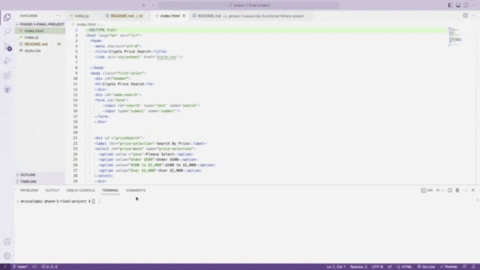

# phase-1-final-project
Crypto Price Search App is an app that allows you to easily search for current prices of crypto-currency by name or by price range. 

## Description

This app utilizes the promise-based Fetch API method to access data from the coincap api. The app has three files -- an html, javaScript and css file. The app primarily utilizes JavaScript to manipulate the data received from the coincap json file. The app does this through three unique JavaScript event listeners -- a submit event listener that allows the user to search for a crypto-currency by name, a change event listener that gives the user the ability to utilize a drop-down menu to search for crypto-currency by price range, and a mouseover event listener that adds a bit more interactivity by giving the user the ability to see the 24 hour percent change in price when a user hovers over the respective crypto-currency's name. A seperate function is triggered that appends the respective crypto-currency's name, symbol and price to the DOM after the user searches manually by name or by price range. 


## Getting Started

To get started open the index.html in the your browser




### Dependencies

* Describe any prerequisites, libraries, OS version, etc., needed before installing program.
* ex. Windows 10

### Installing

* How/where to download your program
* Any modifications needed to be made to files/folders

### Executing program

* How to run the program
* Step-by-step bullets
```
code blocks for commands
```

## Help

Any advise for common problems or issues.
```
command to run if program contains helper info
```

## Authors

Contributors names and contact info

Anissa Lopez @anissalopez


## Version History

* 0.2
    * Various bug fixes and optimizations
    * See [commit change]() or See [release history]()
* 0.1
    * Initial Release

## License

This project is licensed under the [NAME HERE] License - see the LICENSE.md file for details

## Acknowledgments

Inspiration, code snippets, etc.
* [awesome-readme](https://github.com/matiassingers/awesome-readme)
* [PurpleBooth](https://gist.github.com/PurpleBooth/109311bb0361f32d87a2)
* [dbader](https://github.com/dbader/readme-template)
* [zenorocha](https://gist.github.com/zenorocha/4526327)
* [fvcproductions](https://gist.github.com/fvcproductions/1bfc2d4aecb01a834b46)