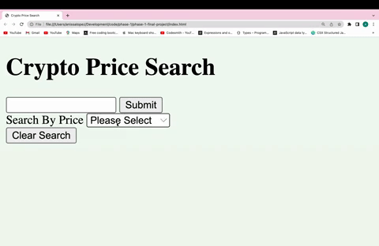

# phase-1-final-project

Crypto Price Search is an app that allows you to easily search for current prices of crypto-currency by name or by price range. 

## Description

This app utilizes the promise-based Fetch API method to access data from the coincap api. The app has three files -- an html, javaScript and css file. The app primarily utilizes JavaScript to manipulate the data received from the coincap api. The app does this through several unique JavaScript event listeners -- a submit event listener that allows the user to search for a crypto-currency by name, a change event listener that gives the user the ability to utilize a drop-down menu to search for crypto-currency by price range, a click event listener that allows the user to clear the DOM elements from the page and a mouseover event listener that adds more interactivity by giving the user the ability to see the 24 hour percent change in price when a user hovers over the respective crypto-currency's name. 

## Using the Program

To get started open the index.html file in the your browser

To use the app you can enter a crypto-currency name in the search box to retrieve information about the crypto-currency's price and symbol. 

Or you can search by price-range using the drop down menu on the webpage.

The app also has functionality that enables a user to utilize the drop down menu to search by price-range and also by name without refreshing the page

To clear the search page simply click "Clear Search" 

Enjoy Searching!

## Authors

Anissa Lopez @anissalopez

## Acknowledgments

Inspiration, code snippets, etc.
* [awesome-readme](https://github.com/matiassingers/awesome-readme)